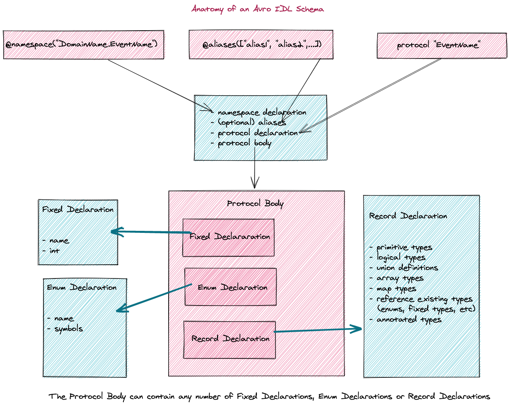

[Apache Avro](https://avro.apache.org/docs/current/) is a binary encoding format that uses a schema to specify the structure of the data being encoded.
    
The [_Avro IDL_](http://avro.apache.org/docs/current/idl.html) (Interface Description Language) is a high level language for authoring Avro schemas. This allows developers to author schemas in a way that feels familiar to writing code, instead of the error-prone process of filling out a JSON schema by hand. In this documentation, we will focus on the [_Avro IDL_](http://avro.apache.org/docs/current/idl.html) that are relevant at Heetch.

???+ info "Content"
    - [Usage](#usage)
    - [Data Types](#data-types)
    - [Naming Conventions](#naming-conventions)
    - [Annotations, Comments, and other language constructs](#annotations-comments-and-other-language-constructs)
    - [Schema Imports](#schema-imports-and-references-to-named-schemata)


???+ tip "An IDL is not unique to Avro"
    > It is important to note that an Interface Description Language (IDL) is simply a descriptive language used to define data types and interfaces in a way that is independent of a programming language or platform.
    An IDL specifies only the syntax used to define the data types and interfaces.

## Usage
In this section, we will walk through the creation of an event schema using the _Avro IDL_, generate the corresponding _Avro JSON schema_ which can then be used by the [avrogo tool](avro-package.md) to generate Go data structures for your services.

This should provide the necessary context before diving into the specifics of authoring schemas with the _Avro IDL_.

???+ info "Avro IDL Schema declaration"
    - [Install the `avro idl` tool](../heetch-schema-bank/#hsbc)
        - Run the `avro idl --help` command to get an idea of how to use the tool
    - Generate the template for your schema using the `avro idl new` command

    **Example: Schema declaration for a service**

    `avro idl new my_new_schema`

    The new schema template:
    > `my_new_schema.avdl`

    will be generated in the `schemas` directory

    === "Generated Schema Template"
    ```c hl_lines="10 11 12 28 35"
    @namespace("service_name")
    protocol service_event {
    /* 
        headers.avdl contains the standard headers that must be included with every
        avro event.
    */
    import idl "../headers.avdl";

    /*
        add other schema imports if needed
        import idl "my_other_service.avdl";
        import schema "my_other_service.avsc"
    */

    @meta({
        "commentary": "This Schema describes version v0.0.0 of the event service_event from the service_name.",
            "version": "0.0.0",
            "event": "service_event",
            "eventDescription": "TODO: Please describe the service_event here.",
            "eventTriggeredBy": "TODO: Please desrcibe the circumstances under which the service_event event is triggered, here.",
            "status": "active",
            "partitions": "1",
        "topickey": "service_name.service_event"

        })
    
    /* Put your enum definitions here. */


    record service_event {
        /* Do not remove the following line */
        meta Metadata;
        
        /* Put your payload definition here. */

    }
    ```

    - **Add service-specific data to the schema template**

    ===! "Update schema template with service data"
    ```c hl_lines="21 28 39"
    @namespace("service_name")
    protocol service_event{
    /* 
        headers.avdl contains the standard headers that must be included with every
        heetch avro event.
    */
    import idl "headers.avdl";

    @meta({
        "commentary": "This Schema describes version v0.0.0 of the event service_event from the service_name.",
            "version": "0.0.0",
            "event": "service_event",
            "eventDescription": "TODO: Please describe the service_event event here.",
            "eventTriggeredBy": "TODO: Please desrcibe the circumstances under which the service_event event is triggered, here.",
            "status": "active",
            "partitions": "1",
        "topickey": "service_name.service_event"

        })

    /* Put your enum definitions here. */
    enum Type {
        payment, 
        payment_adjustment, 
        direct_payment
    }

    enum Mode {
        cash,
        card,
        in_car_with_fee,
        paid_by_platform
    }

    record service_event {
        /* Do not remove the following line */
        meta Metadata;
        
        /* Put your payload definition here. */
        Type PaymentType;

        Mode PaymentMode;  

        string ID;

        union { null, string } AdjustedTransactionID; // optional

        string RideID;

        string BusinessEventName;

        decimal (4, 2) ChargedAmount;

        decimal (4, 2) PlatformFee;

        decimal (4, 2) DriverAmount;

        decimal (3, 2) DiscountAmount;

        string Currency;

        string Country;

        union { null, string } Reason; // optional

        @TimeStamp("timestamp-micros") // using a custom annotation to specify timestamp-micros
        long CreatedAt;

        timestamp_ms UpdatedAt; // using the built-in Avro IDL timestamp_ms logicalType

        string `error`; // using an escaped Avro IDL keyword
    }
    ```

    === "Generate Avro Schema  file (`.avsc`) files from the `.avdl` file"
    ```
    avro idl publish -i service_event.avdl
    ```

    **The new Avro Schema file (`.avsc`) will be generated in the same folder as the `.avdl` file**

    **Bonus**

    You can also generate `Go` data structures from the `.avsc` file using 
    [**the `avrogo` command**](../avro-package/#avrogo-command-line-tool)


## Data Types
As with programming languages, the [_AVRO IDL_](http://avro.apache.org/docs/current/idl.html) defines data types that can be used as building blocks for authoring Avro schemas.

The [_AVRO IDL_](http://avro.apache.org/docs/current/idl.html) defines:

- [primitive data types](#primitive-data-types)
- [complex data types](#complex-data-types)
- [logical types](#logical-types)


??? tip "Reader's Schema vs Writer's Schema"
    > Because a schema is used to tell the datatype of each field, binary data can only be decoded correctly if the code reading the data knows the exact schema that the data was written with. If it uses a different schema, arbitrary data corruption could result.

    > When an application wants to encode data, it encodes the data using whatever schema version it has. This is known as the `writer's schema`. A header is added to the data that encodes a _schema id_ for the schema, which is found by querying the schema registry. This means that an application producing Avro messages _must_ be using a schema that is already registered.
    
    > When an application wants to decode data, it reads it into its own schema, known as the `reader's schema`. This does not have to be the same as the writer's schema, but it does have to be _compatible_. The process of transforming from the writer's schema to the reader's schema is known as _schema resolution_ and full details [are available here](https://avro.apache.org/docs/1.9.1/spec.html#Schema+Resolution).

    > The key idea with Avro is that the `writer's schema` and the `reader's schema` do not have to be the same, they only need to be compatible.


### Primitive Data Types
In _Avro_, _Primitive_ types have no specified attributes, and their names may not be defined in any namespace.

As such, _primitive_ types automatically qualify as defined type names.

=== "Avro IDL declaration for `string` data type"
    ```c
    string ID;
    ```

===! "Equivalent Avro JSON schema (`.avsc`) for `string` data type"
    ```json
    {
        "name": "ID",
        "type": "string"
    }
    ```

The _Avro IDL_ supports the following primitive types:

| Avro IDL declaration | Equivalent Avro JSON schema Type | Description |
| -------------------- | -------------------------------- | ----------- |
| `null` | `null` | no value |
| `boolean` | `boolean` | binary value |
| `int` | `int` | 32-bit signed integer |
| `long` | `long` | 64-bit signed integer |
| `float` | `float` | single precision (32-bit) IEEE 754 floating-point number |
| `double` | `double` | double precision (64-bit) IEEE 754 floating-point number |
| `bytes` | `bytes` | sequence of 8-bit unsigned bytes |
| `string` | `string` | unicode character sequence |


### Complex Data Types
Avro supports the following complex types:

- [records](#records)
- [enums](#enums)
- [arrays](#arrays)
- [maps](#maps)
- [unions](#unions)
- [fixed](#fixed)

#### Records

???+ info "Record Types"
    _Records_ are like `structs` in the sense that they can be composed of both _primitive_ data types and _complex_ data types.

    === "Avro IDL declaration for a record type"
    ```c 
        record Service {
            string service_name;
            boolean is_active;
            timestamp-millis created_at;
        };
    ```

    === "Equivalent Avro JSON schema"
    ```json
        {
            "type": "record",
            "name": "Service",
            "fields" : [
                {"name": "service_name", "type": "string"},
                {"name": "is_active", "type": "boolean"}
                {"name": "created_at", "type": "long", "logicalType": "timestamp-millis"}
            ]
        }
    ```

    !!! warning "Not all complex types can be embedded in a _Record_"
        > Though the Avro specifications suggest that complex types such as `enum` types  and even `record` types can be embedded within a `record`, the _Avro IDL_ does not currently support these types of embeddings.

    **With the current implementation, `record` types can only contain the following types:**

    - `array`
    - `boolean`
    - `double`
    - `float`
    - `int`
    - `long`
    - `map`
    - `bytes`
    - `string`
    - `null`
    - `union`
    - `date`
    - `time_ms`
    - `timestamp_ms`

#### Enums

???+ info "Enum Types"
    Enumerated types are declared using the `enum` keyword.

    For example, to declare an `enum` describing a suit of playing cards:

    === "Avro IDL declaration for an enum type"
    ```c
        enum Suit {
            SPADES, HEARTS, DIAMONDS, CLUBS
        }
    ```

    === "Equivalent Avro JSON schema"
    ```json
        { 
            "type": "enum",
            "name": "Suit",
            "symbols" : ["SPADES", "HEARTS", "DIAMONDS", "CLUBS"]
        }
    ```

#### Arrays

???+ info "Array Types"
    The `array` type can be used to declare a list of items defined by the same attribute.

    **Example: `array of strings`**

    === "Avro IDL declaration for array of strings"
    ```c
        array<string> mountain_ranges;
    ```

    === "Equivalent Avro JSON schema"
    ```json
        {
            "type": "array", 
            "name": "mountain_ranges",
            "items": "string"
        }
    ```

    **Example: `array of ints`**

    === "Avro IDL declaration for array of ints"
    ```c
        array<int> number_bases;
    ```

    === "Equivalent Avro JSON schema"
    ```json
        {
            "type": "array", 
            "name": "number_bases",
            "items": "int"
        }
    ```

#### Maps

???+ info "Map Types"
    The `map` type can be used to declare a list of key-value pairs, where all keys are constrained to be `string` types.

    **Example: Map with `strings` as _keys_ (by default), and `longs` as _values_**

    === "Avro IDL declaration for a map with `longs` as values"
    ```c
        map<long> astronomical_units_to_meters;
    ```

    === "Equivalent Avro JSON schema"
    ```json
        {
            "type": "map",
            "name": "astronomical_units_to_meters",
            "values": "long"
        }
    ```

#### Unions

???+ info "Union Types"
    `union` types are often used to declare fields with optional values

    **Example: `union` declaring a schema which may be either a `null` type or a `string` type**

    === "Avro IDL declaration for an optional string"
    ```c
        union { null, string } optionalString;
    ```

    === "Equivalent Avro JSON schema"
    ```json
    {
        "name": "optionalString",
        ["null", "string"]
    }
    ```

    **Rules**

    When a default value is specified for a record whose type is a `union`, the type of the default value must match the first element of the `union`.

    Thus for `unions` containing `null`, the `null` SHOULD be listed first since the default value of such `unions` is typically `null`

    **Restrictions on Combining `unions`**

    - `unions` may not immediately contain other `unions`
    - `unions` may not contain more than one schema with the same type except for `record` types, `fixed` types and `enum` types
        - `unions` containing two `array` types or two `map` types are not permitted, but two types with different names are permitted. This is because _names_ permit efficient resolution when reading and writing `unions`.

#### Fixed

???+ info "Fixed Types"
    `fixed` types are user-defined types where the specific number of bytes required to hold the type is explicitly declared. The number of bytes is specified as a positive integer.

    **Example: a 16-byte quantity for holding an md5 hash**

    === "Avro IDL declaration for an MD5 hash type"
    ```c
        fixed MD5(16);
    ```

    === "Equivalent Avro JSON schema"
    ```json
        {
            "type": "fixed", 
            "size": 16, 
            "name": "MD5"
        }
    ```


### Logical Types
A `logical` type is an Avro primitive or complex type with extra attributes to represent a derived type. 

The attribute `logicalType` must always be present for a `logical` type. It is a `string` representation of one of these `logical` types:

- `decimal`
- `uuid` 
- `date` 
- `time-micros`
- `timestamp-micros`
- `time-millis` 
- `timestamp-millis` 

!!! warning "Only `timestamp-millis` and `time-millis` and `date` supported"
    > In the current implementation of the _Avro IDL_, only the `timestamp-millis`, `time-millis` and `date` `logicalType` are supported. The other `logicalTypes` are supported in Avro JSON schemas, but cannot be generated with the _Avro IDL_.

**Serialization of `logicalType`**

A `logical` type is always serialized using its underlying Avro type so that values are encoded in exactly the same way as the equivalent Avro type that does not have a `logicalType` attribute. 

Thus, if a `logical` type is invalid, for example a decimal with scale greater than its precision, then implementations COULD ignore the `logical` type and use the underlying Avro type.


??? warning "`Decimal` Logical Type Not Yet supported in _Avro IDL_"

    The `decimal` logical type represents an arbitrary-precision signed decimal number of the form:
    
    > unscaled × 10-scale.

    **Example: schema representing `decimal` numbers with a maximum precision of 4 and a scale of 2**

    === "Avro IDL declaration for the decimal logical type"
    ```c
        decimal(4,2) dailyEarnings;
    ```

    === "Equivalent Avro JSON schema"
    ```json
        {
            "type": "bytes", // underlying Avro type
            "logicalType": "decimal",
            "name": "dailyEarnings",
            "precision": 4,
            "scale": 2
        }
    ```

    | Attributes | Required or Optional? | Description |
    | ---------- | --------------------- | ----------- |
    | `precision` | REQUIRED | the MAXIMUM number of digits that can be represented, irrespective of the position of the decimal point |
    | `scale` | OPTIONAL | the number of fractional digits. If not specified, the `scale` is defined as `0` |

    Ex: Given the declaration:

    > `decimal(4) dailyEarnings;`

    The following decimals are all valid:
    >    - 9999
    >    - -9999
    >    - ... and all other digits between {-9999, 9999}


    !!! tip "A `scale` value of `0` resolves to integer values since there are no fractional digits"

    **Restrictions**

    - `precision` must be a positive integer (greater than zero). If the underlying type is a `fixed` type, then the precision is limited by its size
    - `scale` must be `0` or a positive integer less than or equal to the precision

    Ex: Given the declaration:

    > `decimal(4, 2) rideFees;`

    The following decimals are all valid:
    >    - 99.99
    >    - -99.99
    >    - ... and all other decimals between {-99.99, 99.99}


    !!! tip "A `scale` value equal to the `precision` value resolves to a decimal with only fractional digits"


    Ex: Given the declaration:

    > `decimal (4, 4) commission;`

    The following decimals are valid:
    >    - 0.999
    >    - -0.999
    >    - ... and all other decimals between {-0.999, 0.999}


    !!! tip "When resolving schemas, two schemas that are `decimal` logical types match if their scales and precisions match"


??? warning "`UUID` Logical Type Not Yet supported in _Avro IDL_"
    The `uuid` logical type represents a random generated, universally unique identifier (UUID).

    It annotates an Avro `string` type that conforms with [RFC-4122](https://tools.ietf.org/html/rfc4122)

    **Example: named schema for representing a _user_id_ with a `UUID` logical type**

    === "Avro IDL declaration for a UUID logical type"
    ```c
        UUID user_id;
    ```

    === "Equivalent Avro JSON schema"
    ```json
    {
        "name": "user_id",
        "type": "string",
        "logicalType": "UUID"
    }
    ```


??? warning "`Date` Logical Type Not Yet supported in _Avro IDL_"
    The `date` logical type represents a date, with NO reference to time zone or time of day.

    It annotates an Avro `int` type, where the `int` stores the number of days from the unix epoch (1 January 1970 [ISO Calendar])

    **Example: named schema for representing April Fool's day with a `date` logical type**

    === "Avro IDL declaration for a date logical type"
    ```c
        date april_fools_day;
    ```

    === "Equivalent Avro JSON schema"
    ```json
    {
        "name": "april_fools_day",
        "type": "int",
        "logicalType": "date"
    }
    ```

???+ info "Logical Types for representing `Time`"

    | Logical Type | Precision | Underlying Avro Type | Storage | Description |
    | ------------ | --------- | -------------------- | ------- | ----------- |
    | `time-millis` | 1 millisecond | `int` | number of **milliseconds** after midnight, 00:00:00.000 | represents a time of day, with no reference to a particular calendar, time zone or date |
    | `time-micros` | 1 microsecond | `long` | numer of **microseconds** after midnight, 00:00:00.000000 | represents a time of day, with no reference to a particular calendar, time zone or date |
    | `timestamp-millis` | 1 millisecond | `long` | number of **milliseconds** from the unix epoch, 1 January 1970 00:00:00.000 UTC | represents an instant on the global timeline, independent of a particular time zone or calendar |
    | `timestamp-micros` | 1 microsecond | `long` | number of **microseconds** from the unix epoch, 1 January 1970 00:00:00.000000 UTC | represents an instant on the global timeline, independent of a particular time zone or calendar |

    **Example: named timestamp for representing the time a user account was created, using a `timestamp-millis` logical type**

    === "Avro IDL declaration for a timestamp-millis logical type"
    ```c
        timestamp-millis created_at;
    ```

    === "Equivalent Avro JSON schema"
    ```json
    {
        "name": "created_at",
        "type": "long",
        "logicalType": "timestamp-millis"
    }
    ```

    !!! warning "`timestamp-micros` and `time-micros` not currently supported in Avro-IDL."
        Use a custom annotation instead such as:

        ```c
            @heetchTimeStamp("timestamp-micros") // using a custom annotation to specify timestamp-micros
            long CreatedAt;
        ```

## Naming Conventions
### Named Types

???+ info "Defining _named_ types"
    `records`, `enums`, and `fixed` types are _named_ types, where each _fullname_ consists of:

    - `name`: starts with characters that match `[A-Za-z_]`, and CAN subsequently contain characters that match `[A-Za-z0-9_]`
    - `namespace`: dot-separated sequence of _name_-like tokens that qualify a _name_. The empty string can be used to indicate the null namespace

    **Restrictions**

    - The uniqueness of the _name_ associated with a _named_ type is defined on the _fullname_
    - The check for equality on _names_ (including `field` names and `enum` symbols) is case-sensitive
    - A schema may not contain multiple definitions of a _fullname_
    - A _name_ must be defined before it is used

### Aliases

???+ info "Using `aliases` for _named_ types and `fields`"
    _Aliases_ provide a mechanism for flexibility when declaring a schema. They allow named types and fields to be optionally mapped to other named types and fields, which makes it easier for schemas to evolve.

    **Example: specifying `type` and `field` aliases, using the `@alias` annotation**

    ```c
    @aliases(["OldRecord", "AncientRecord"])
    record MyRecord { // map the named record type `MyRecord` to `OldRecord` and `AncientRecord`
        string @aliases(["oldField", "ancientField"]) myNewField; // map the record's string field `myNewField` to `oldField` and `ancientField`
    }
    ```

    Consequently, the named record type `MyRecord` can also be referenced as `OldRecord` or `AncientRecord`. 

    Similarly, `MyRecord`'s named string field `myNewField` can also be referenced as `oldField` or `ancientField`.

    In the context of event driven applications, this means that _producers_ can safely update the schemas, without worrying about introducing breaking changes for the _consumers_, since aliases provide a mechanism for backwards compatibility.


## Annotations, Comments and Other Language Constructs
The annotation tag (`@`) is used to specify certain properties of the annotated element.

Here are some common annotations:

| annotation | description |
| ---------- | ----------- |
| `@namespace` | specify `namespace` of a `record`, or modify the `namespace` when defininig a named schema |
| `@aliases` | specify `type` and `field` aliases of a `record` |


???+ info "Examples of annotations"

    **Modify the `namespace` when defining a _named_ schema, using the `@namespace` annotation**

    ```c++
        @namespace("legacy.bookkeeping")
        protocol transaction_created {
            @namespace("current.bookkeeping")
            record current_transaction {}

            record legacy_transaction {}
        }
    ```

    where the `transaction_created` _protocol_ is defined in the `legacy.bookkeeping` namespace, the _record_ `current_transaction` is defined in the `current.bookkeeping` namespace and the _record_ `legacy_transaction` is defined in the `legacy.bookkeeping` namespace, since it inherits its default _namespace_ from its container.


    !!! tip "annotations can be used to include arbitrary JSON elements"
        > JSON elements that are not directly supported in the _Avro IDL_, such as Heetch-specific metadata, or certain logical types such as `timestamp-micros` can be declared using annotation tags.

    For example:

    === "Declaring a Heetch-specific timestamp using annotations"
    ```c
    @heetchTimeStamp("timestamp-micros") // using the generic annotation to specify timestamp-micros
    long CreatedAt;
    ```

    === "Equivalent Avro JSON format"
    ```json
    {
        "name" : "CreatedAt",
        "type" : {
        "type" : "long",
        "heetchTimeStamp" : "timestamp-micros"
        }
    }
    ```

**Comments**

The _Avro IDL_ supports `C`-style comments, where:

- any text following `//` on a line is ignored
- any text between `/*` and `*/` (possibly spanning multiple lines) is ignored


**Using reserved language keywords as identifiers**

In the rare occasion that a reserved language keyword needs to be used as an identifier, the backtick character \`\` can be wrapped around the keyword.

> error => \`error\`


## Schema Imports and References to Named Schemas
When authoring schemas, files may be imported using the `import` directive as follows:

- `import idl "foo.avdl"` to import an IDL schema
- `import schema "foo.avsc"` to import a JSON schema

Imported file names are resolved relative to the current IDL file

???+ info "References to Named Schemas and Types"
    If a named type has already been defined or imported in the same Avro IDL file, it may be referenced by name, as if it were a primitive type. 

    Example: 

    Given a schema specifying a suit of cards:

    ```c
    enum Suit {
    SPADES, HEARTS, DIAMONDS, CLUBS
    }
    ```

    It can be referenced in a schema specifying a card as:

    ```c
    record Card {
    Suit suit; // refers to the enum Card defined above
    int number;
    }
    ```


That's it! You now have all the information needed to author schemas using the _Avro IDL_.
Take a glance at the [usage](#usage) section if you're not sure where to begin.





## References
- [Apache Avro Documentation](http://avro.apache.org/docs/current/index.html)
- [Avro Specification](http://avro.apache.org/docs/current/spec.html)
- [Avro IDL](http://avro.apache.org/docs/current/idl.html)


???+ info "Need help?"
    - post a message on **Slack** on the `#support` channel.
    - please provide as much context as possible

    **Did you find this page useful?**

    :heart_eyes:󠀠󠀠 [**Yep!**](https://forms.gle/DPKLG2KpNnam79VNA)

    :weary: [**No I did not**](https://forms.gle/DPKLG2KpNnam79VNA)


**Maintained by:** Kelvin Spencer
